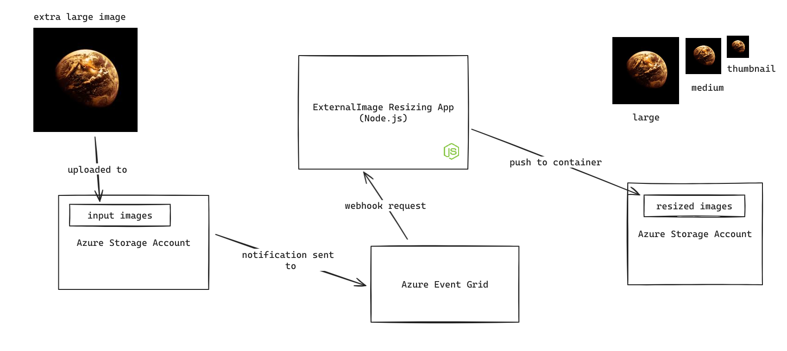

# Image Resizing App Utilizing Event Grid

This is a demo image resizing application that uses Azure Event Grid to receive event notifications and processes an image. The process is as follows:

1. An Azure Blob Storage Account Gen2 is created
1. Two containers, input_images, and resized-images, are created within the storage account
1. An event subscription is created to listen to the `Microsoft.Storage.BlobCreated` event and call this application's route, `/process-image` as a webhook
1. Once an image is uploaded to the input_images container, it is processed and a zipped up version of the resized images is sent to the `resized-images` folder on the storage account.

You can view the app's architecture here:

## Prerequisites

1. You need an Azure Subscription with access to create resources to run this demo. You can obtain a free account with $200 credits using [this link](https://azure.microsoft.com/en-us/free). Note that the credits will expire after a month. You can also obtain a student subscription with $100 credits valid for one year using [this link](https://signup.azure.com/studentverification?offerType=1).

2. Aside the Azure subscription, you need Node.js to run the app. You can install Node.js from the official website: [https://nodejs.org](https://nodejs.org/en/download/package-manager)

## Setting the app

To run the app, create an environment file, .env, from the example environment file, .env.example. You can run `cp .env.example .env` on your terminal to ease the process. With the `.env` file available, [create a storage account on Azure](https://learn.microsoft.com/en-us/azure/storage/common/storage-account-create?tabs=azure-portal) and copy its connection string as the value of the `AZURE_BLOB_STORAGE_CONNECTION_STRING` `.env` key.

Within the storage account, create two containers, one called "input_images" and another called "resized-images". Now, in the [index.js file](src/index.js), find the outputBlobContainer variable and set it's value to `resized-images`.

## Setting up the Event Subscription

Within the storage account Events blade, create a new subscription. You can use the visual below:

## Running the app

With all the setup completed, run `npm install` to install the required Node.js dependencies and complete the run by running `npm start`.

## Testing the app

You can see the app live in action by uploading an image to the input_images container on Azure. It shold download the image to the `files_to_be_processed` folder, create the resized images in the `processed_images` folder, and finally, store the zipped images in the `archived_images` folder.

The final step the app carries out is uploading the zip archive to the resized-images container, making it available for download.
